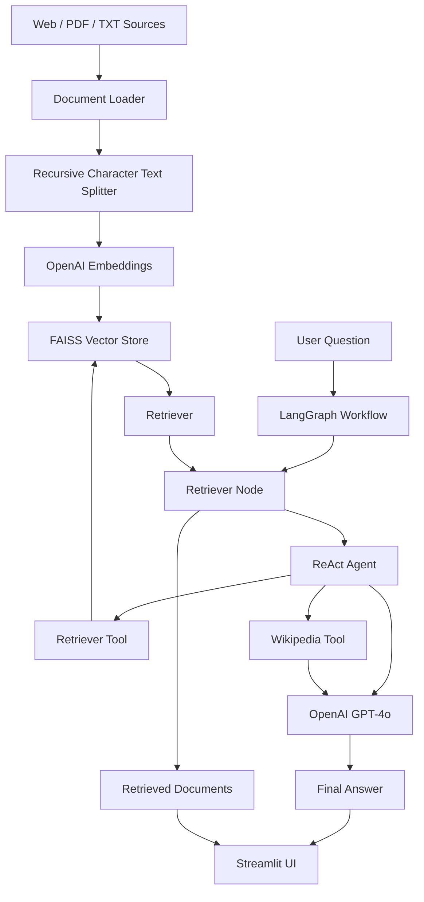

# Agentic RAG Knowledge Assistant

An **Agentic Retrieval-Augmented Generation (RAG)** application built with **LangChain, LangGraph, OpenAI GPT-4o, OpenAI Embeddings, FAISS, and Streamlit**.

The application loads content from configured web pages and PDF/TXT sources, splits the content into smaller chunks, creates vector embeddings, stores them in a FAISS vector index, and uses a LangGraph workflow with a **ReAct agent** to answer user questions. The agent can use both the indexed document retriever and a Wikipedia search tool when generating an answer.

---

## Features

- Retrieval-Augmented Generation over indexed documents
- Web, PDF, and TXT document loading support
- Recursive text chunking with configurable chunk size and overlap
- OpenAI embeddings for semantic representation
- FAISS vector store for similarity-based retrieval
- LangGraph workflow for stateful RAG execution
- ReAct agent with tool calling
- Retriever tool for searching the indexed corpus
- Wikipedia tool for general-knowledge queries
- OpenAI GPT-4o for answer generation
- Streamlit web interface
- Retrieved source-document inspection
- Recent query history in the UI
- Response-time measurement

---

## Architecture



---

## RAG Workflow

### 1. Document Ingestion

The project can load content from:

- URLs using `WebBaseLoader`
- A PDF directory using `PyPDFDirectoryLoader`
- TXT files using `TextLoader`

### 2. Text Splitting

Loaded documents are split using `RecursiveCharacterTextSplitter`.

Current configuration:

- Chunk size: `500`
- Chunk overlap: `50`

This creates smaller text segments that can be embedded and retrieved more effectively.

### 3. Embedding Generation

Each document chunk is converted into a vector representation using **OpenAI Embeddings**.

### 4. Vector Storage and Retrieval

The generated embeddings are stored in a **FAISS** vector store. A retriever is created from the FAISS index and is used to find relevant document passages for a user query.

### 5. LangGraph Workflow

The main RAG flow is implemented with **LangGraph** using two application-level nodes:

1. `retriever` – retrieves relevant documents for the current question.
2. `responder` – invokes the ReAct-based agent to generate the final answer.

The graph then terminates after the response is generated.

### 6. ReAct Agent and Tools

The responder contains a **ReAct agent** with two tools:

- `retriever` – searches the indexed project corpus and returns relevant passages.
- `wikipedia` – searches Wikipedia for general knowledge.

The agent is instructed to prefer the project retriever for user-provided documents and use Wikipedia for general knowledge.

### 7. Answer Generation

The selected information is passed through the agent and **OpenAI GPT-4o** generates the final response.

---

## Technology Stack

| Category | Technology |
|---|---|
| Language | Python |
| LLM | OpenAI GPT-4o |
| Framework | LangChain |
| Agent / Workflow | LangGraph, ReAct Agent |
| Embeddings | OpenAI Embeddings |
| Vector Store | FAISS |
| Document Loading | WebBaseLoader, PyPDFDirectoryLoader, TextLoader |
| Text Processing | RecursiveCharacterTextSplitter |
| External Tool | Wikipedia API |
| UI | Streamlit |
| Configuration | Python Dotenv |
| Data Validation / State | Pydantic |

---

## Project Structure

```text
agentic-rag-knowledge-assistant/
│
├── data/
│   ├── attention.pdf
│   └── url.txt
│
├── src/
│   ├── config/
│   │   └── config.py
│   │
│   ├── document_ingestion/
│   │   └── document_processor.py
│   │
│   ├── graph_builder/
│   │   └── graph_builder.py
│   │
│   ├── node/
│   │   ├── nodes.py
│   │   └── reactnode.py
│   │
│   ├── state/
│   │   └── rag_state.py
│   │
│   └── vectorstore/
│       └── vectorstore.py
│
├── main.py
├── streamlit_app.py
├── requirements.txt
├── pyproject.toml
└── README.md
```

---

## Configuration

The project reads the OpenAI API key from an environment variable.

Create a `.env` file in the project root:

```env
OPENAI_API_KEY=your_openai_api_key
```

Do **not** commit your real API key to GitHub.

The main configuration is located in:

```text
src/config/config.py
```

Current model configuration:

```python
LLM_MODEL = "openai:gpt-4o"
```

Default source URLs are also configured there.

---

## Installation

### 1. Clone the repository

```bash
git clone https://github.com/<your-username>/agentic-rag-knowledge-assistant.git
cd agentic-rag-knowledge-assistant
```

### 2. Create a virtual environment

```bash
python -m venv .venv
```

Activate it on Linux/macOS:

```bash
source .venv/bin/activate
```

Activate it on Windows:

```powershell
.venv\Scripts\activate
```

### 3. Install dependencies

```bash
pip install -r requirements.txt
```

### 4. Configure the API key

Create `.env`:

```env
OPENAI_API_KEY=your_openai_api_key
```

---

## Run the Streamlit Application

Start the web UI with:

```bash
streamlit run streamlit_app.py
```

The application initializes the RAG system, loads the configured documents, creates the FAISS vector store, builds the LangGraph workflow, and opens the Streamlit interface.

You can then:

1. Enter a question.
2. Submit the query.
3. View the generated answer.
4. Expand the **Source Documents** section to inspect retrieved passages.
5. Review recent searches and response times.

---

## Run from the Command Line

The project also provides a CLI entry point:

```bash
python main.py
```

This initializes the RAG system and runs example questions before optionally entering interactive mode.

---

## Example Questions

The current application includes example questions such as:

```text
What is the concept of agent loop in autonomous agents?

What are the key components of LLM-powered agents?

Explain the concept of diffusion models for video generation.
```

You can also enter your own questions from the Streamlit UI.

---

## Key Components

### `DocumentProcessor`

Responsible for document ingestion and text splitting.

Main responsibilities:

- Load URLs
- Load PDF documents
- Load TXT files
- Split documents into chunks

### `VectorStore`

Responsible for semantic indexing and retrieval.

Main responsibilities:

- Create OpenAI embeddings
- Build the FAISS vector store
- Expose the retriever
- Retrieve relevant documents

### `GraphBuilder`

Responsible for constructing and executing the LangGraph workflow.

### `RAGNodes`

Contains the retriever node and the ReAct-agent-based response generation logic.

### `RAGState`

Defines the shared state used by the LangGraph workflow, including:

- User question
- Retrieved documents
- Generated answer

### `streamlit_app.py`

Provides the interactive web interface and manages cached RAG initialization and query history.

---

## Example End-to-End Flow

```text
User Question
     |
     v
LangGraph
     |
     v
Retriever Node
     |
     v
ReAct Agent
   /     \
  /       \
Retriever  Wikipedia
 Tool        Tool
  \          /
   \        /
     v     v
   Relevant Information
          |
          v
     OpenAI GPT-4o
          |
          v
      Final Answer
```

---

## What Makes This Agentic RAG

This project goes beyond a basic question-to-LLM pipeline by introducing an agent that can decide which tool to use while answering a query.

For document-focused questions, the agent can use the indexed **retriever tool**. For general-knowledge questions, it can use the **Wikipedia tool**. The ReAct pattern allows the agent to reason through the available actions and then return a final answer.

---

## Current Scope

The current implementation focuses on:

- Text-based RAG
- Web/PDF/TXT document ingestion
- Semantic retrieval with FAISS
- Single ReAct agent
- Retriever + Wikipedia tool calling
- LangGraph orchestration
- Streamlit-based interaction

---

## Future Enhancements

Potential improvements for the project include:

- Persistent FAISS index storage and reload support
- User-provided document upload from the Streamlit UI
- Metadata filtering during retrieval
- Retrieval quality evaluation
- Reranking of retrieved passages
- Hybrid keyword + vector retrieval
- Conversation-aware retrieval
- LangSmith tracing and evaluation
- Additional tools and more advanced agent workflows
- Production deployment with containerization

---

## Security Notes

- Keep the OpenAI API key in environment variables.
- Do not commit `.env` files containing secrets.
- Review external URLs before indexing their content.

---

